---
## Author
author:
  name: Гашимова Эсма Эльшан кызы
  email: 1132247520@rudn.ru
  affiliation:
    - name: Российский университет дружбы народов
      country: Российская Федерация
      postal-code: 117198
      city: Москва
      address: ул. Миклухо-Маклая, д. 6

## Title
title: "Отчёт по лабораторной работе №3"
subtitle: "Настройка DHCP-сервера"
license: "CC BY"
---

# Цель работы

Приобретение практических навыков по установке и конфигурированию DHCP сервера.

# Выполнение лабораторной работы

## Установка DHCP-сервера

На виртуальной машине server устанавливаю DHCP-сервер Kea. Установка пакета и необходимых зависимостей завершилась успешно (см. рис. [@fig-001]).

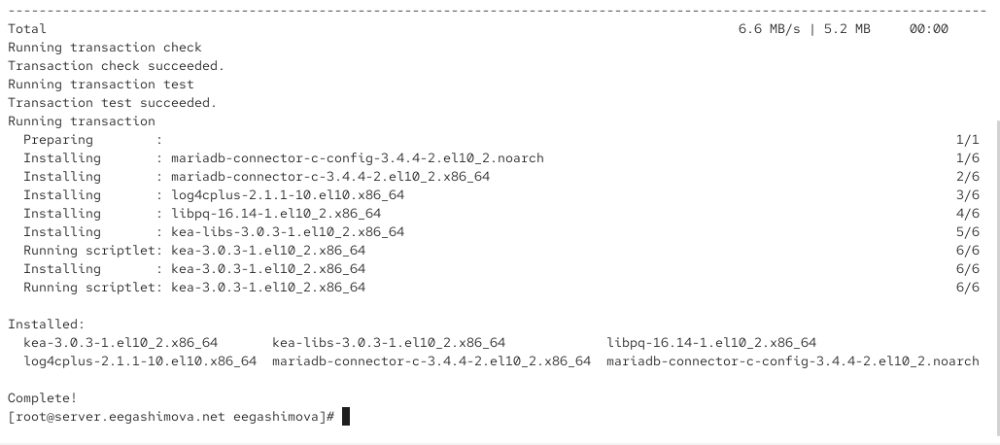{ #fig-001 width=70% }

## Конфигурирование DHCP-сервера

Редактирую конфигурацию DHCP-сервера. В качестве DNS-сервера задаю адрес 192.168.1.1, доменное имя и домен поиска — eegashimova.net (см. рис. [@fig-002]).

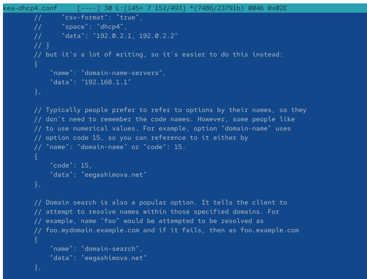{ #fig-002 width=70% }

Настраиваю подсеть 192.168.1.0/24. Для клиентов задаю диапазон адресов 192.168.1.30–192.168.1.199 и шлюз 192.168.1.1 (см. рис. [@fig-003]).

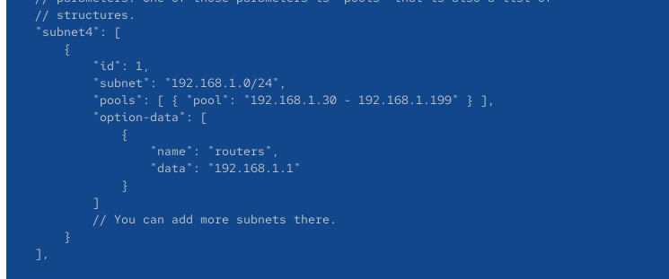{ #fig-003 width=70% }

DHCP-сервер привязываю к интерфейсу eth1 внутренней сети (см. рис. [@fig-004]).

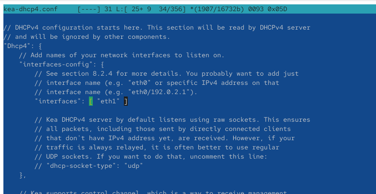{ #fig-004 width=70% }

Проверяю конфигурацию Kea и включаю автоматический запуск службы. Ошибок, препятствующих запуску сервера, не обнаружено (см. рис. [@fig-005]).

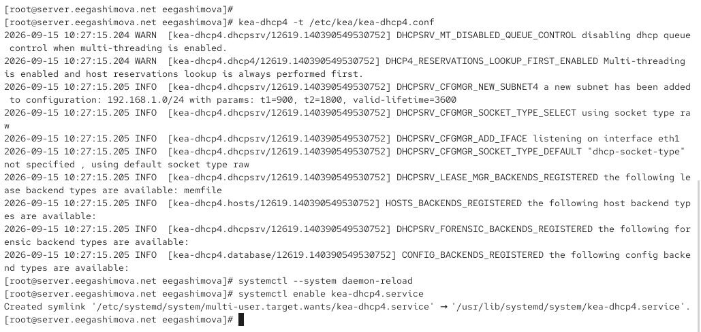{ #fig-005 width=70% }

В прямую DNS-зону добавляю имя dhcp.eegashimova.net с адресом 192.168.1.1 (см. рис. [@fig-006]).

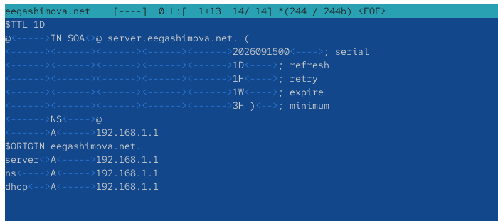{ #fig-006 width=70% }

В обратной DNS-зоне добавляю PTR-запись для DHCP-сервера (см. рис. [@fig-007]).

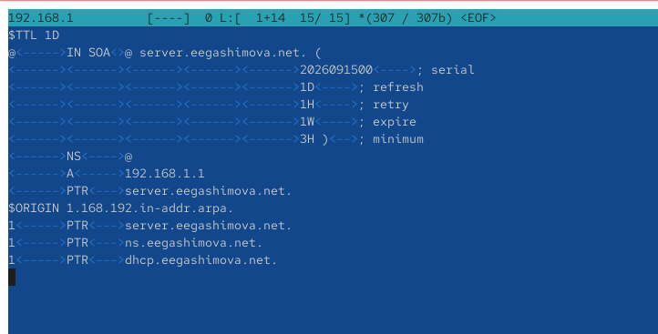{ #fig-007 width=70% }

После перезапуска DNS-сервера проверяю доступность имени dhcp.eegashimova.net. Имя разрешается в адрес 192.168.1.1, потерь пакетов нет (см. рис. [@fig-008]).

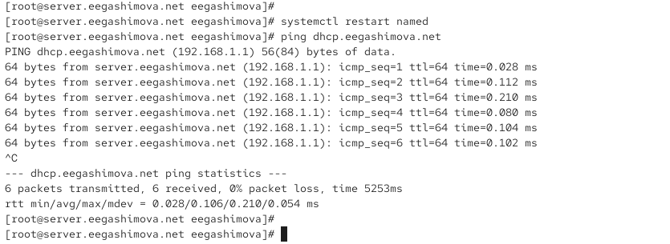{ #fig-008 width=70% }

Разрешаю работу DHCP в межсетевом экране, восстанавливаю контексты SELinux и запускаю службу Kea DHCPv4 (см. рис. [@fig-009]).

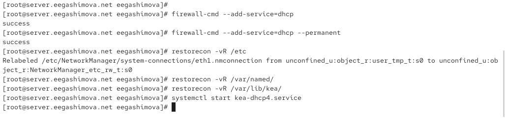{ #fig-009 width=70% }

## Проверка работы DHCP-сервера

Для виртуальной машины client настраиваю маршрутизацию через интерфейс eth1 и шлюз 192.168.1.1 (см. рис. [@fig-010]).

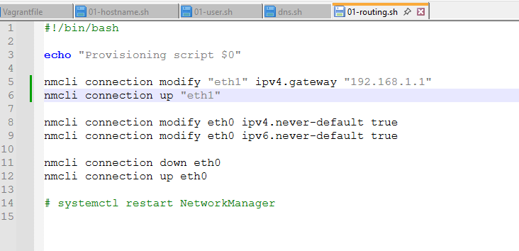{ #fig-010 width=70% }

Проверяю сетевые интерфейсы клиента. Интерфейс eth0 имеет адрес 10.0.2.15, а eth1 получил по DHCP адрес 192.168.1.30 из настроенного диапазона (см. рис. [@fig-011]).

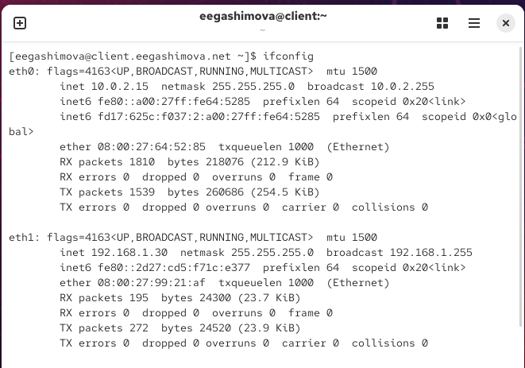{ #fig-011 width=70% }

На сервере просматриваю файл выданных аренд. В нём зарегистрирован клиент с адресом 192.168.1.30 и MAC-адресом 08:00:27:99:21:af. Время аренды составляет 3600 секунд, идентификатор подсети — 1 (см. рис. [@fig-012]).

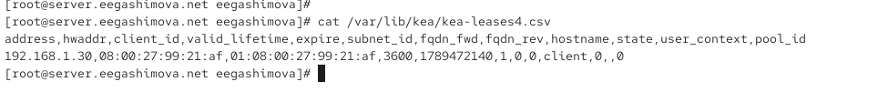{ #fig-012 width=70% }

## Настройка динамического обновления DNS

Создаю TSIG-ключ DHCP_UPDATER для безопасного динамического обновления DNS-зон и назначаю необходимые права доступа (см. рис. [@fig-013]).

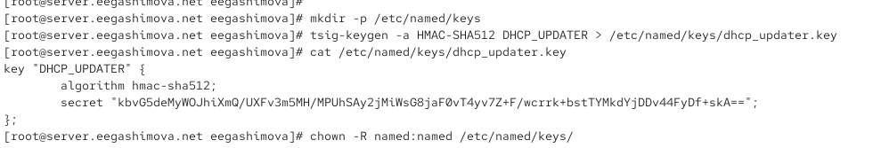{ #fig-013 width=70% }

В конфигурации BIND разрешаю ключу DHCP_UPDATER изменять A- и DHCID-записи прямой зоны eegashimova.net и PTR-записи обратной зоны (см. рис. [@fig-014]).

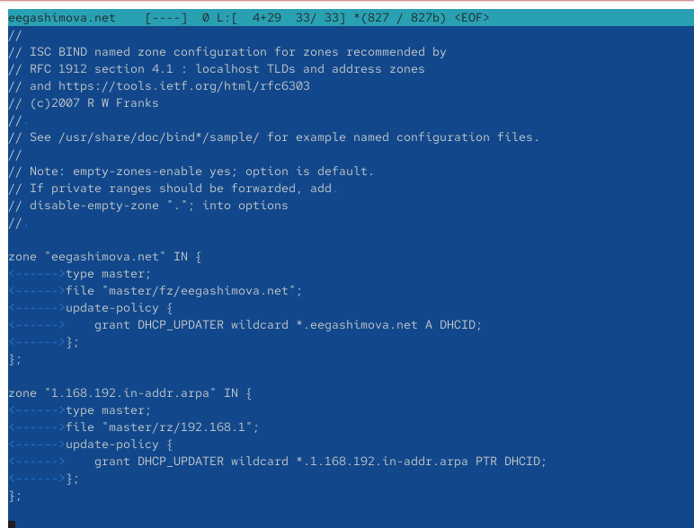{ #fig-014 width=70% }

Для Kea сохраняю параметры TSIG-ключа в отдельном конфигурационном файле (см. рис. [@fig-015]).

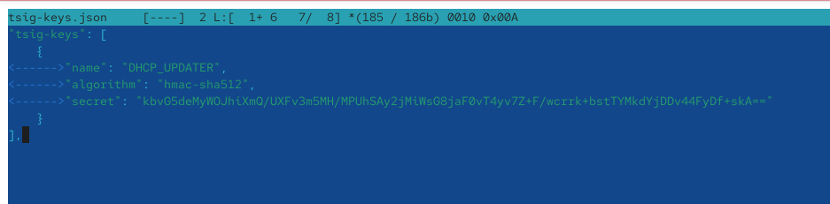{ #fig-015 width=70% }

Настраиваю службу Kea DHCP-DDNS. Для прямой и обратной зон используется DNS-сервер 192.168.1.1 и ключ DHCP_UPDATER (см. рис. [@fig-016]).

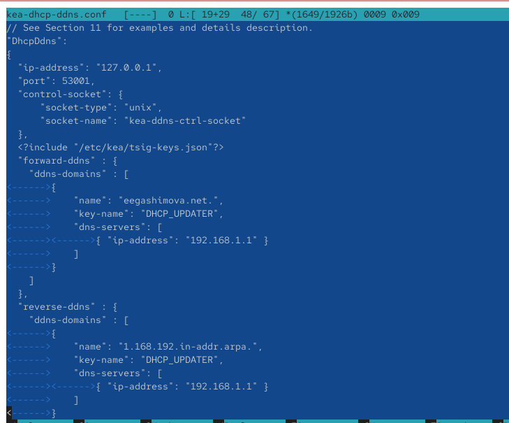{ #fig-016 width=70% }

Проверка конфигурации DHCP-DDNS завершается успешно. Служба включена и находится в состоянии active (running) (см. рис. [@fig-017]).

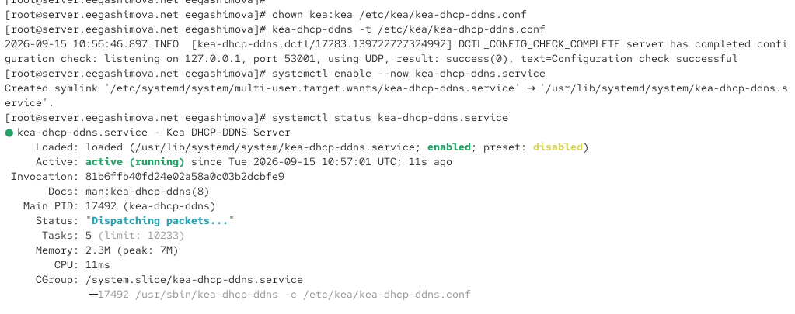{ #fig-017 width=70% }

В конфигурации DHCPv4 включаю динамические DNS-обновления и задаю доменный суффикс eegashimova.net (см. рис. [@fig-018]).

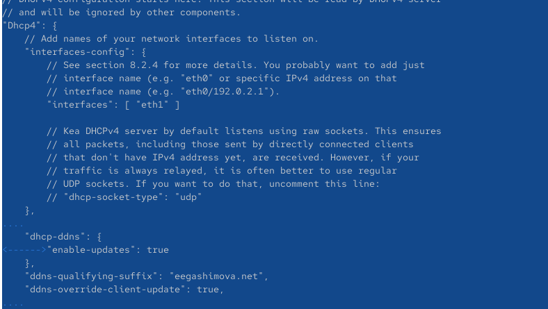{ #fig-018 width=70% }

После внесения изменений перезапускаю DHCP-сервер. Служба Kea DHCPv4 успешно работает и имеет состояние active (running) (см. рис. [@fig-019]).

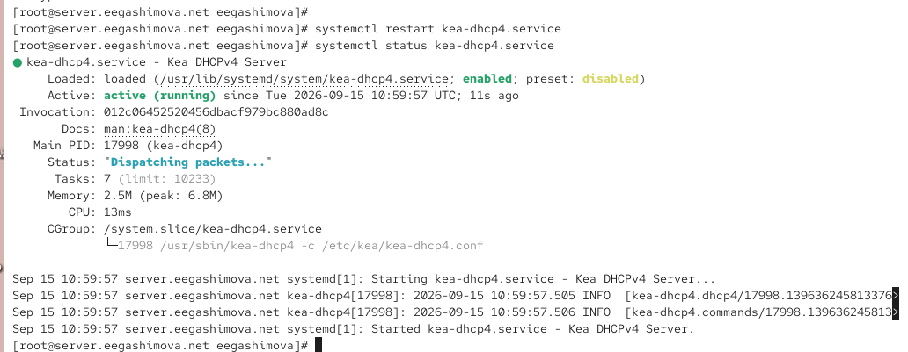{ #fig-019 width=70% }

## Проверка обновления DNS-зоны

На клиенте выполняю DNS-запрос к серверу 192.168.1.1. Запрос завершается со статусом NOERROR, а имя client.eegashimova.net разрешается в адрес 192.168.1.30. Это подтверждает корректную работу динамического обновления DNS (см. рис. [@fig-020]).

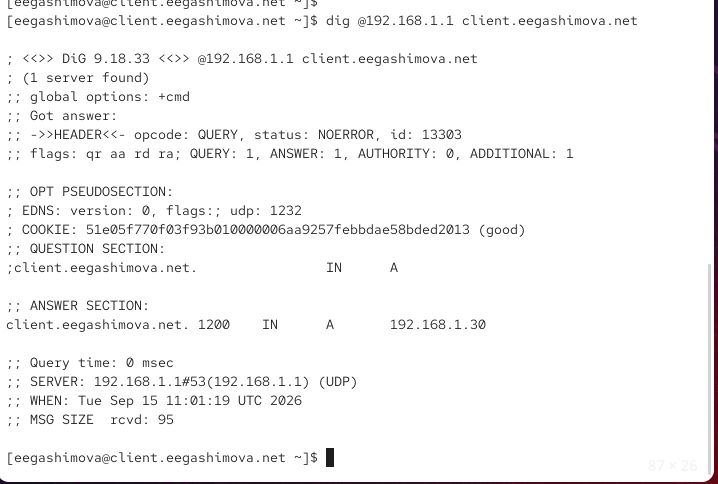{ #fig-020 width=70% }

## Автоматизация настройки DHCP-сервера

Копирую конфигурационные файлы Kea и BIND в каталог provision виртуальной машины server и создаю исполняемый файл dhcp.sh. При копировании части символических ссылок BIND выводятся предупреждения Protocol error (см. рис. [@fig-021]).

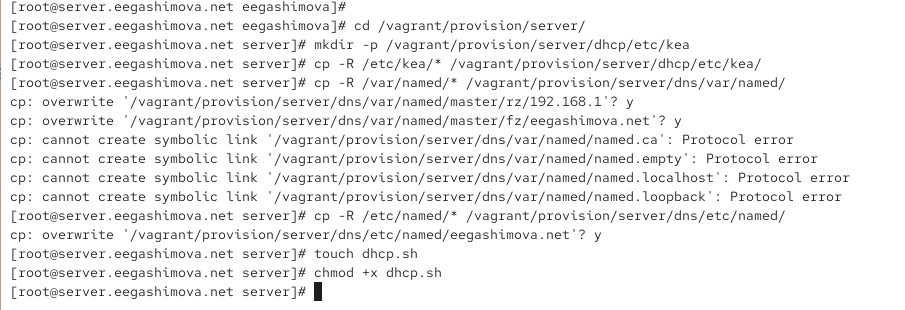{ #fig-021 width=70% }

В файле dhcp.sh фиксирую установку Kea, копирование конфигурации, настройку прав и SELinux, межсетевого экрана, а также запуск служб DHCPv4 и DHCP-DDNS (см. рис. [@fig-022]).

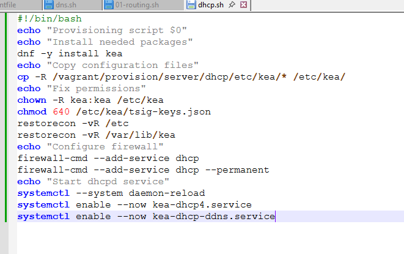{ #fig-022 width=70% }

В результате DHCP-сервер выдаёт клиенту адрес из заданного диапазона, а механизм DHCP-DDNS автоматически создаёт DNS-запись для подключённого узла.

# Вывод

В ходе лабораторной работы на виртуальной машине `server` установлен и настроен DHCP-сервер Kea. Для сети `192.168.1.0/24` задан диапазон адресов `192.168.1.30–192.168.1.199`, шлюз и DNS-сервер `192.168.1.1`.

На машине `client` проверено получение адреса по DHCP. Клиенту был выдан адрес `192.168.1.30`. Далее настроено динамическое обновление DNS с использованием `kea-dhcp-ddns` и TSIG-ключа `DHCP_UPDATER`. Проверка командой `dig` подтвердила автоматическое создание записи `client.eegashimova.net`.

В завершение конфигурационные файлы сохранены в проекте Vagrant и создан скрипт `dhcp.sh` для автоматизации настройки DHCP-сервера.

# Контрольные вопросы

**1. В каких файлах хранятся настройки сетевых подключений?**

В системах с `NetworkManager` настройки обычно находятся в каталоге:

```text
/etc/NetworkManager/system-connections/
```

Каждому подключению соответствует файл `.nmconnection`, содержащий IP-адрес, шлюз, DNS и другие сетевые параметры.

**2. За что отвечает протокол DHCP?**

DHCP автоматически выдаёт клиентам сетевые параметры: IP-адрес, маску подсети, шлюз, DNS-сервер и срок аренды адреса.

**3. Поясните принцип работы протокола DHCP. Какими сообщениями обмениваются клиент и сервер?**

Получение адреса выполняется в четыре этапа:

```text
DHCPDISCOVER → поиск DHCP-сервера
DHCPOFFER    → предложение IP-адреса
DHCPREQUEST  → запрос предложенного адреса
DHCPACK      → подтверждение выдачи адреса
```

Также используются сообщения `DHCPNAK`, `DHCPRELEASE`, `DHCPDECLINE` и другие.

**4. В каких файлах обычно находятся настройки DHCP-сервера? За что отвечает каждый из файлов?**

Основные файлы Kea:

```text
/etc/kea/kea-dhcp4.conf
```

содержит настройки DHCPv4: подсети, пулы адресов, интерфейсы, шлюзы и DNS.

```text
/etc/kea/kea-dhcp-ddns.conf
```

содержит настройки динамического обновления DNS.

```text
/etc/kea/tsig-keys.json
```

содержит TSIG-ключ для защищённого обновления DNS.

Файл:

```text
/var/lib/kea/kea-leases4.csv
```

хранит сведения о выданных IPv4-адресах.

**5. Что такое DDNS? Для чего применяется DDNS?**

DDNS — механизм динамического обновления DNS-записей. Он позволяет автоматически добавлять или изменять DNS-запись после получения клиентом нового IP-адреса по DHCP.

Например:

```text
client.eegashimova.net → 192.168.1.30
```

**6. Какую информацию можно получить, используя утилиту ifconfig?**

`ifconfig` показывает информацию о сетевых интерфейсах: IP-адрес, маску, MAC-адрес, MTU, количество переданных и полученных пакетов и ошибки.

Примеры:

```bash
ifconfig
ifconfig eth1
ifconfig -a
```

`ifconfig eth1` показывает параметры интерфейса `eth1`, а `ifconfig -a` — все интерфейсы, включая неактивные.

**7. Какую информацию можно получить, используя утилиту ping?**

`ping` используется для проверки доступности сетевого узла и измерения времени ответа.

Примеры:

```bash
ping 192.168.1.1
ping -c 4 192.168.1.1
ping -i 2 192.168.1.1
```

Параметр `-c 4` ограничивает количество запросов четырьмя, а `-i 2` задаёт интервал между запросами в две секунды.

В результате можно определить количество отправленных и полученных пакетов, процент потерь, `TTL` и время ответа.
