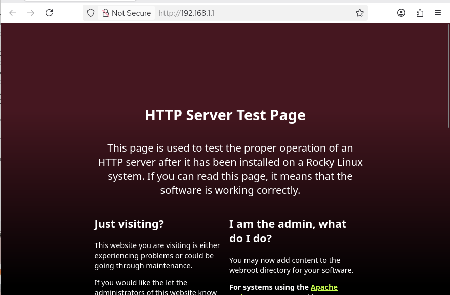
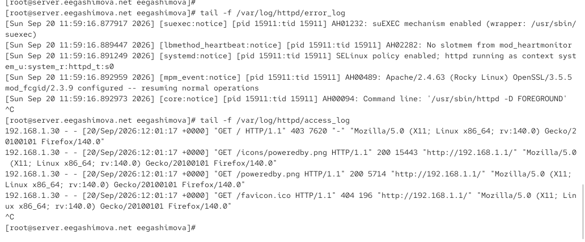
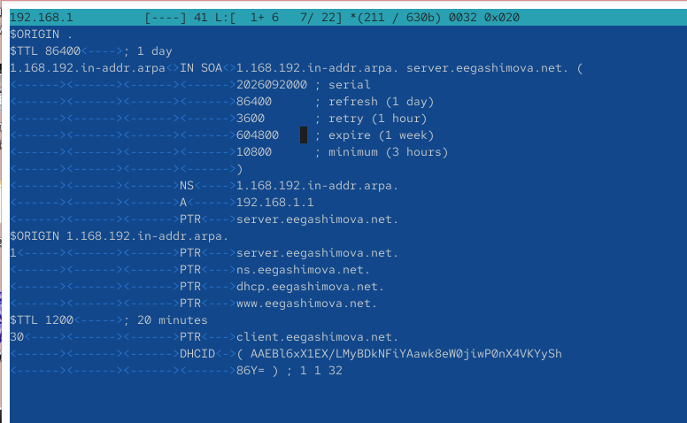
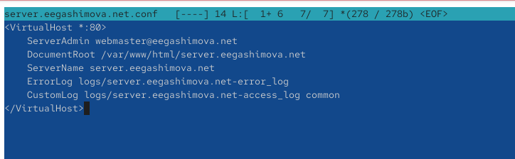
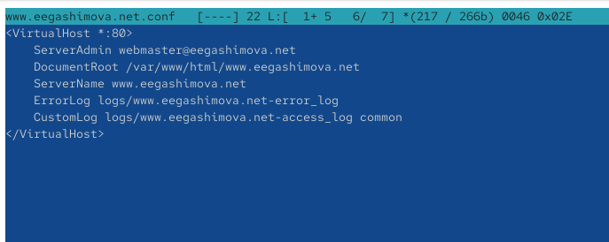
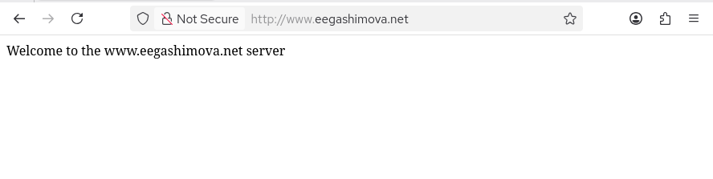

---
## Author
author:
  name: Гашимова Эсма Эльшан кызы
  email: 1132247520@rudn.ru
  affiliation:
    - name: Российский университет дружбы народов
      country: Российская Федерация
      postal-code: 117198
      city: Москва
      address: ул. Миклухо-Маклая, д. 6

## Title
title: Лабораторная работа №4
subtitle: Базовая настройка HTTP-сервера Apache
license: CC BY
date: today
date-format: "YYYY-MM-DD"
---

# Цели и задачи работы

## Цель лабораторной работы

Приобретение практических навыков установки, базовой настройки и проверки работы HTTP-сервера Apache на виртуальной машине `server`.

Также необходимо настроить виртуальный хостинг для двух DNS-имён и подготовить provisioning-скрипт для автоматизации настройки через Vagrant.

# Процесс выполнения лабораторной работы

## Установка HTTP-сервера

{ #fig:001 width=70% height=70% }

## Настройка firewalld и запуск Apache

{ #fig:002 width=70% height=70% }

## Проверка базовой страницы Apache

{ #fig:003 width=70% height=70% }

## Анализ журналов Apache

{ #fig:004 width=70% height=70% }

## Настройка прямой DNS-зоны

{ #fig:005 width=70% height=70% }

## Настройка обратной DNS-зоны

{ #fig:006 width=70% height=70% }

## Виртуальный хост server.eegashimova.net

{ #fig:007 width=70% height=70% }

## Виртуальный хост www.eegashimova.net

{ #fig:008 width=70% height=70% }

## Создание веб-контента

{ #fig:009 width=70% height=70% }

## Проверка server.eegashimova.net

{ #fig:010 width=70% height=70% }

## Проверка www.eegashimova.net

{ #fig:011 width=70% height=70% }

## Сохранение конфигурации для Vagrant

{ #fig:012 width=70% height=70% }

## Скрипт автоматической настройки

{ #fig:013 width=70% height=70% }

# Результаты работы

## Установка и запуск HTTP-сервера

На виртуальной машине `server` был установлен стандартный веб-сервер Apache из группы пакетов `Basic Web Server`.

Служба `httpd` была добавлена в автозагрузку и успешно запущена.

В межсетевом экране `firewalld` был разрешён сервис `http`.

## Проверка работы Apache

Работа HTTP-сервера была проверена с виртуальной машины `client` по адресу:

```text
192.168.1.1
````

В браузере отобразилась стандартная тестовая страница Apache.

Также были проанализированы журналы:

```text
/var/log/httpd/access_log
/var/log/httpd/error_log
```

## Настройка виртуального хостинга

Были настроены два виртуальных хоста:

```text
server.eegashimova.net
www.eegashimova.net
```

Для каждого виртуального хоста был создан отдельный конфигурационный файл Apache и отдельный каталог с веб-контентом.

## Проверка виртуальных хостов

На виртуальной машине `client` была выполнена проверка доступа к обоим DNS-именам.

Для `server.eegashimova.net` отображалась страница:

```text
Welcome to the server.eegashimova.net server.
```

Для `www.eegashimova.net` отображалась страница:

```text
Welcome to the www.eegashimova.net server.
```

## Автоматизация настройки

Конфигурационные файлы Apache и веб-контент были сохранены в каталоге проекта Vagrant.

Был создан скрипт:

```text
/vagrant/provision/server/http.sh
```

Скрипт устанавливает Apache, копирует конфигурационные файлы, настраивает права доступа, восстанавливает контексты SELinux, разрешает HTTP в `firewalld` и запускает службу `httpd`.

## Вывод

В результате выполнения лабораторной работы был установлен и настроен HTTP-сервер Apache.

Была проверена его базовая работа по IP-адресу `192.168.1.1`.

Также был настроен виртуальный хостинг для двух DNS-имён: `server.eegashimova.net` и `www.eegashimova.net`.

Созданный provisioning-скрипт позволяет автоматически воспроизвести настройку HTTP-сервера при развёртывании виртуальной машины `server` через Vagrant.
