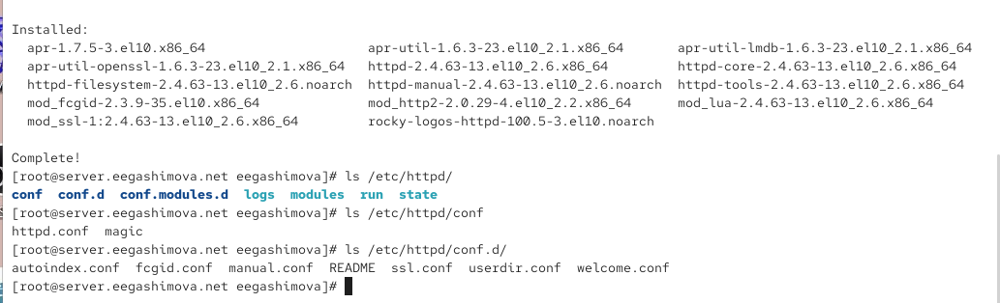
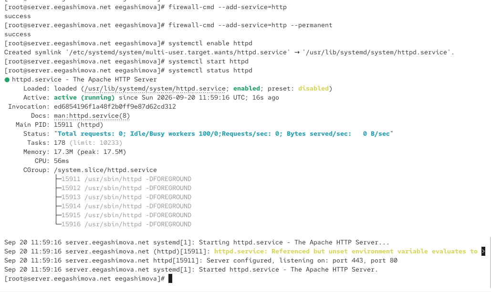
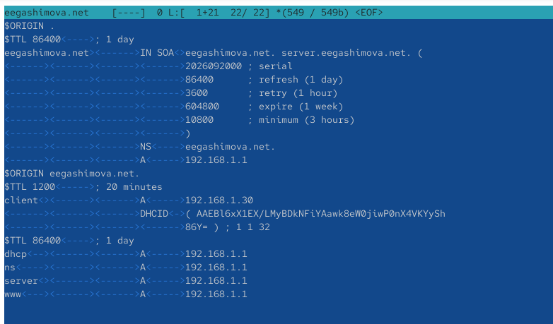
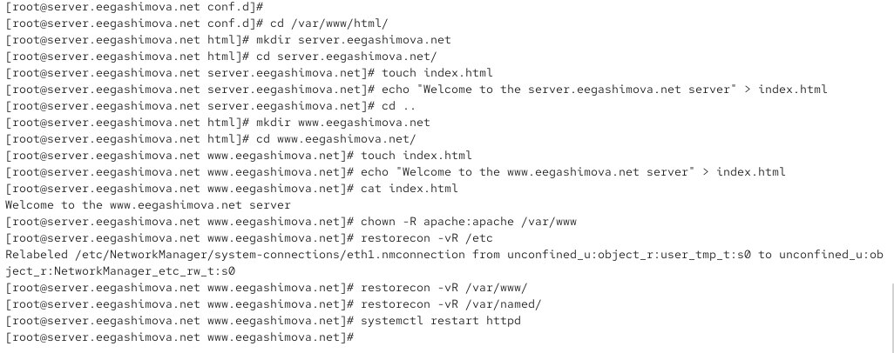
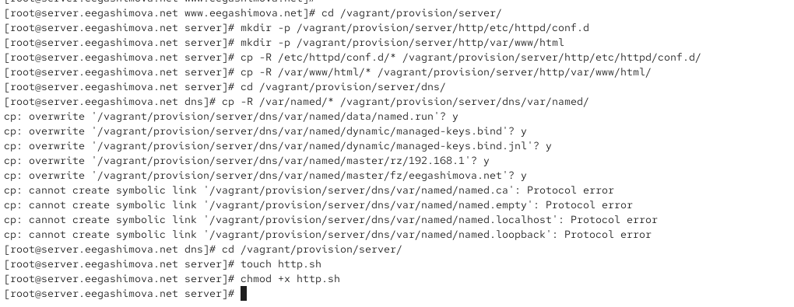
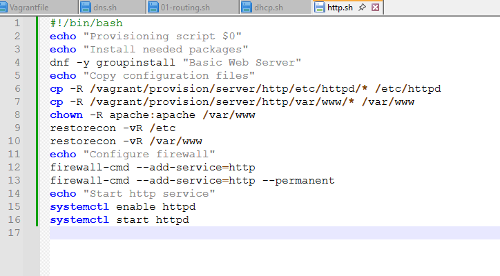

---
## Author
author:
  name: Гашимова Эсма Эльшан кызы
  email: 1132247520@rudn.ru
  affiliation:
    - name: Российский университет дружбы народов
      country: Российская Федерация
      postal-code: 117198
      city: Москва
      address: ул. Миклухо-Маклая, д. 6

## Title
title: "Отчёт по лабораторной работе №4"
subtitle: "Базовая настройка HTTP-сервера Apache"
license: "CC BY"
---

# Цель работы

Приобретение практических навыков по установке и базовому конфигурированию HTTP-сервера Apache.

# Выполнение лабораторной работы

## Установка HTTP-сервера

На виртуальной машине server устанавливаю стандартный HTTP-сервер Apache и необходимые для его работы компоненты из группы пакетов `Basic Web Server`. После завершения установки проверяю структуру каталогов `/etc/httpd`, `/etc/httpd/conf` и `/etc/httpd/conf.d`. Основной конфигурационный файл сервера находится в `/etc/httpd/conf/httpd.conf`, а дополнительные настройки и конфигурации модулей располагаются в `/etc/httpd/conf.d` (см. рис. [@fig-001]).

{ #fig-001 width=70% }

## Базовое конфигурирование HTTP-сервера

Разрешаю HTTP-трафик в межсетевом экране. Сервис `http` добавляю как в текущую конфигурацию `firewalld`, так и в постоянную конфигурацию. Затем включаю автоматический запуск службы `httpd` и запускаю веб-сервер. Проверка состояния службы показывает состояние `active (running)`, что свидетельствует об успешном запуске Apache (см. рис. [@fig-002]).

{ #fig-002 width=70% }

## Проверка работы HTTP-сервера

На виртуальной машине client открываю в браузере адрес HTTP-сервера `192.168.1.1`. В браузере отображается стандартная тестовая страница Apache HTTP Server, следовательно, сервер доступен по сети и обрабатывает HTTP-запросы от клиента (см. рис. [@fig-003]).

{ #fig-003 width=70% }

На виртуальной машине server анализирую журналы работы Apache. В файле `/var/log/httpd/error_log` отображается информация о запуске сервера, используемых модулях и работе SELinux. В журнале `/var/log/httpd/access_log` фиксируются HTTP-запросы от клиента с адресом `192.168.1.30`. Для запроса к корневому ресурсу зафиксирован код `403`, для части ресурсов страницы — код `200`, а запрос к `favicon.ico` завершился кодом `404` (см. рис. [@fig-004]).

{ #fig-004 width=70% }

## Настройка DNS для виртуального хостинга

Для организации виртуального хостинга редактирую прямую DNS-зону `eegashimova.net`. Для имени `www.eegashimova.net` добавляю запись типа `A`, указывающую на IP-адрес HTTP-сервера `192.168.1.1`. В зоне также присутствует запись `server.eegashimova.net` с тем же адресом (см. рис. [@fig-005]).

{ #fig-005 width=70% }

В обратной DNS-зоне сети `192.168.1.0/24` добавляю PTR-запись, связывающую адрес `192.168.1.1` с именем `www.eegashimova.net`. В зоне также содержится обратная запись для `server.eegashimova.net` (см. рис. [@fig-006]).

{ #fig-006 width=70% }

## Настройка виртуальных хостов Apache

В каталоге `/etc/httpd/conf.d` создаю конфигурационный файл `server.eegashimova.net.conf`. Для виртуального хоста задаю имя `server.eegashimova.net`, каталог с веб-контентом `/var/www/html/server.eegashimova.net`, адрес администратора и отдельные журналы ошибок и доступа (см. рис. [@fig-007]).

{ #fig-007 width=70% }

Аналогично создаю конфигурационный файл `www.eegashimova.net.conf`. Для второго виртуального хоста задаю имя `www.eegashimova.net`, каталог `/var/www/html/www.eegashimova.net`, а также отдельные журналы ошибок и доступа (см. рис. [@fig-008]).

{ #fig-008 width=70% }

## Создание веб-страниц виртуальных хостов

В каталоге `/var/www/html` создаю отдельные каталоги `server.eegashimova.net` и `www.eegashimova.net`. В каждом каталоге создаю файл `index.html` с текстом, позволяющим определить, к какому виртуальному серверу произошло обращение.

После создания веб-контента назначаю владельцем каталога `/var/www` пользователя и группу `apache`. Затем восстанавливаю контексты безопасности SELinux для `/etc`, `/var/www` и `/var/named` и перезапускаю службу `httpd` для применения новой конфигурации (см. рис. [@fig-009]).

{ #fig-009 width=70% }

## Проверка виртуального хостинга

На виртуальной машине client открываю в браузере адрес `server.eegashimova.net`. HTTP-сервер корректно определяет имя запрошенного виртуального хоста и отображает страницу с сообщением `Welcome to the server.eegashimova.net server` (см. рис. [@fig-010]).

{ #fig-010 width=70% }

Затем проверяю второй виртуальный хост по адресу `www.eegashimova.net`. В браузере отображается соответствующая тестовая страница с сообщением `Welcome to the www.eegashimova.net server`, что подтверждает корректную работу виртуального хостинга по двум DNS-именам (см. рис. [@fig-011]).

{ #fig-011 width=70% }

## Сохранение конфигурации для Vagrant

Перехожу в каталог `/vagrant/provision/server` и создаю структуру каталогов для хранения конфигурационных файлов HTTP-сервера. Копирую в неё содержимое `/etc/httpd/conf.d` и веб-контент из `/var/www/html`.

Также обновляю сохранённую конфигурацию DNS-сервера, копируя содержимое `/var/named` в каталог `/vagrant/provision/server/dns/var/named`. Основные файлы DNS-зон перезаписываются. При попытке копирования некоторых стандартных символических ссылок `named.*` выводятся сообщения `Protocol error`. После этого создаю исполняемый файл `http.sh`, предназначенный для автоматической установки и настройки HTTP-сервера (см. рис. [@fig-012]).

{ #fig-012 width=70% }

## Создание скрипта автоматической настройки HTTP-сервера

В файл `/vagrant/provision/server/http.sh` записываю команды, повторяющие выполненную вручную настройку сервера. Скрипт устанавливает группу пакетов `Basic Web Server`, копирует сохранённые конфигурационные файлы Apache и веб-контент, назначает владельцем веб-каталогов пользователя `apache`, восстанавливает контексты SELinux, разрешает HTTP-трафик в `firewalld`, включает автоматический запуск `httpd` и запускает службу (см. рис. [@fig-013]).

{ #fig-013 width=70% }

# Вывод

В ходе лабораторной работы на виртуальной машине `server` установлен и настроен HTTP-сервер Apache. Для доступа к веб-серверу разрешён сервис `http` в межсетевом экране `firewalld`, служба `httpd` добавлена в автозагрузку и успешно запущена.

Работа HTTP-сервера проверена с виртуальной машины `client` по адресу `192.168.1.1`. Также проанализированы журналы `access_log` и `error_log`, позволяющие отслеживать обращения клиентов и ошибки в работе веб-сервера.

Далее настроен виртуальный хостинг для адресов `server.eegashimova.net` и `www.eegashimova.net`. Для каждого виртуального хоста создан отдельный каталог с веб-контентом и конфигурационный файл Apache. Проверка через браузер подтвердила корректное отображение страниц обоих виртуальных серверов.

В завершение конфигурационные файлы HTTP-сервера сохранены в проекте Vagrant и создан скрипт `http.sh`, автоматизирующий установку, настройку и запуск Apache.

# Контрольные вопросы

**1. Через какой порт по умолчанию работает Apache?**

По умолчанию HTTP-сервер Apache принимает HTTP-запросы через TCP-порт:

```text
80
````

Для защищённого протокола HTTPS обычно используется TCP-порт `443`.

**2. Под каким пользователем запускается Apache и к какой группе относится этот пользователь?**

В используемой системе рабочие процессы Apache запускаются от имени пользователя:

```text
apache
```

Пользователь относится к группе:

```text
apache
```

Соответствующие параметры задаются в конфигурации Apache:

```text
User apache
Group apache
```

Главный процесс `httpd` запускается с правами `root`, поскольку ему необходимо открыть системный порт `80`, после чего обработка клиентских запросов выполняется рабочими процессами с ограниченными правами пользователя `apache`.

**3. Где располагаются лог-файлы веб-сервера? Что можно по ним отслеживать?**

Основные журналы Apache располагаются в каталоге:

```text
/var/log/httpd/
```

Основными файлами являются:

```text
/var/log/httpd/access_log
/var/log/httpd/error_log
```

В `access_log` фиксируются обращения клиентов к веб-серверу: IP-адрес клиента, запрошенный ресурс, время запроса, используемый HTTP-метод и код ответа сервера.

В `error_log` записываются сообщения об ошибках, проблемы запуска и настройки Apache, ошибки доступа к файлам и другая диагностическая информация.

Для виртуальных хостов могут использоваться отдельные журналы, например:

```text
server.eegashimova.net-access_log
server.eegashimova.net-error_log
www.eegashimova.net-access_log
www.eegashimova.net-error_log
```

**4. Где по умолчанию содержится контент веб-серверов?**

По умолчанию веб-контент Apache располагается в каталоге:

```text
/var/www/html/
```

Путь к содержимому сайта определяется директивой `DocumentRoot`. Для созданных в работе виртуальных хостов используются отдельные каталоги:

```text
/var/www/html/server.eegashimova.net
/var/www/html/www.eegashimova.net
```

**5. Каким образом реализуется виртуальный хостинг? Что он даёт?**

Виртуальный хостинг позволяет одному HTTP-серверу обслуживать несколько веб-сайтов с разными доменными именами на одном IP-адресе.

В Apache виртуальный хост задаётся блоком:

```apache
<VirtualHost *:80>
    ServerName server.eegashimova.net
    DocumentRoot /var/www/html/server.eegashimova.net
</VirtualHost>
```

Для второго сайта создаётся другой блок с собственными параметрами `ServerName` и `DocumentRoot`.

При получении HTTP-запроса Apache анализирует имя хоста, переданное клиентом, и выбирает соответствующую конфигурацию виртуального сервера.

Виртуальный хостинг позволяет размещать несколько независимых сайтов на одной машине и одном IP-адресе, используя для каждого сайта собственное доменное имя, каталог с контентом и журналы работы.


