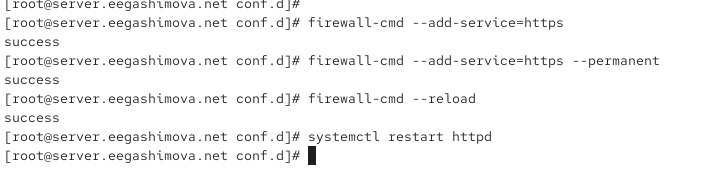
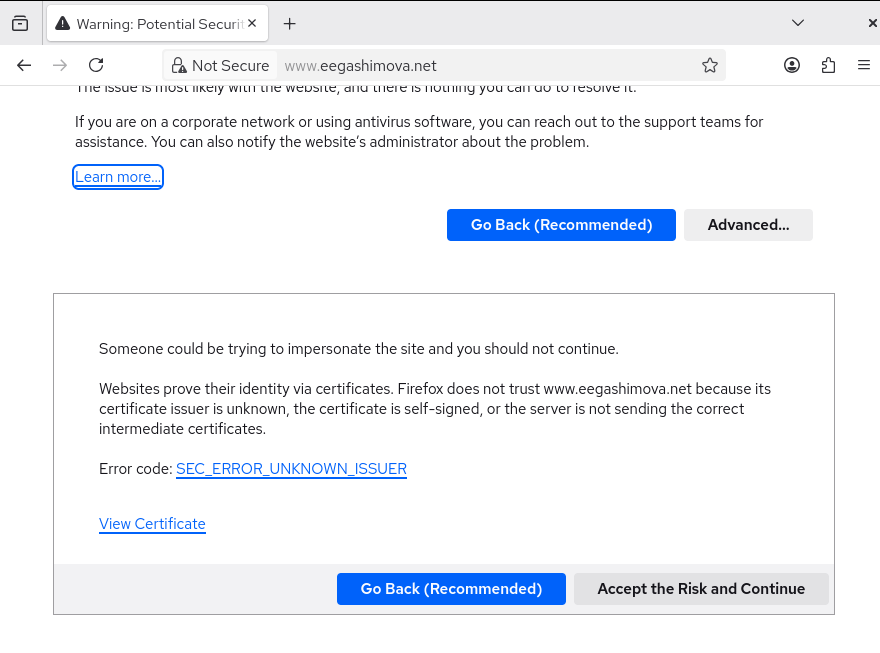
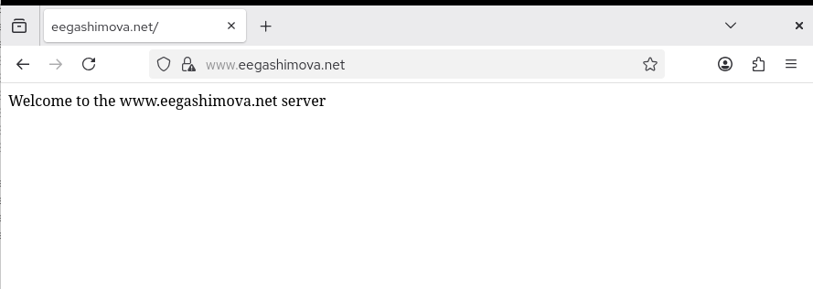
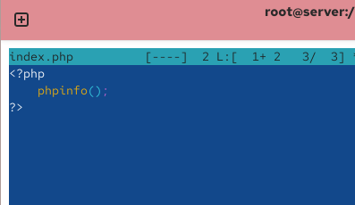
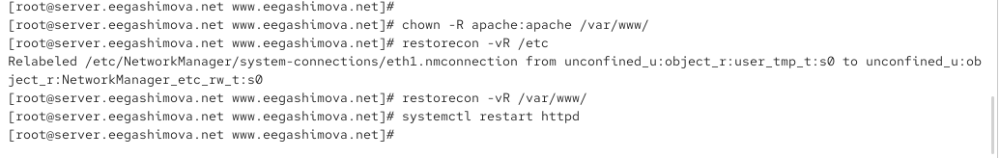
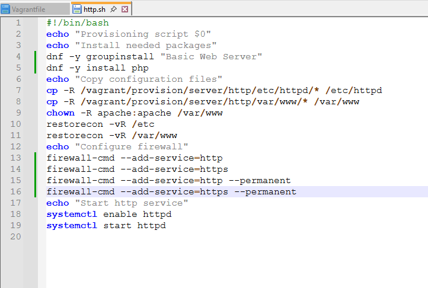

---
## Author
author:
  name: Гашимова Эсма Эльшан кызы
  email: 1132247520@rudn.ru
  affiliation:
    - name: Российский университет дружбы народов
      country: Российская Федерация
      postal-code: 117198
      city: Москва
      address: ул. Миклухо-Маклая, д. 6

## Title
title: Лабораторная работа №5
subtitle: Расширенная настройка HTTP-сервера Apache
license: CC BY
date: today
date-format: "YYYY-MM-DD"
---

# Цели и задачи работы

## Цель лабораторной работы

Настроить веб-сервер Apache для работы по протоколу HTTPS.

Также необходимо добавить поддержку PHP и сохранить выполненные настройки в проекте Vagrant.

# Процесс выполнения лабораторной работы

## Генерация ключа и сертификата

{ #fig:001 width=70% height=70% }

## Настройка виртуального хоста HTTPS

{ #fig:002 width=70% height=70% }

## Настройка firewalld

{ #fig:003 width=70% height=70% }

## Проверка сертификата в браузере

{ #fig:004 width=70% height=70% }

## Проверка работы HTTPS

{ #fig:005 width=70% height=70% }

## Просмотр сведений о сертификате

{ #fig:006 width=70% height=70% }

## Установка PHP

{ #fig:007 width=70% height=70% }

## Создание PHP-страницы

{ #fig:008 width=70% height=70% }

## Настройка прав и SELinux

{ #fig:009 width=70% height=70% }

## Проверка работы PHP

{ #fig:010 width=70% height=70% }

## Сохранение конфигурации для Vagrant

{ #fig:011 width=70% height=70% }

## Обновление скрипта http.sh

{ #fig:012 width=70% height=70% }

# Результаты работы

## Настройка HTTPS

Для веб-сервера `www.eegashimova.net` были сгенерированы закрытый ключ и самоподписанный сертификат.

В конфигурации Apache был настроен виртуальный хост на порту:

```text
443
```

Также было настроено перенаправление HTTP-запросов на HTTPS.

## Проверка HTTPS

На виртуальной машине `client` был открыт адрес:

```text
www.eegashimova.net
```
Браузер выполнил переход на HTTPS. После добавления исключения для самоподписанного сертификата сайт успешно открылся.

## Настройка PHP

На сервере был установлен пакет:

```text
php
```

В каталоге сайта был создан файл:

```text
/var/www/html/www.eegashimova.net/index.php
```

Файл содержит вызов функции:

```php
phpinfo();
```

## Проверка PHP

После перезапуска Apache в браузере отобразилась страница `phpinfo()`.

Это подтвердило, что веб-сервер корректно обрабатывает PHP-файлы.

## Вывод

В ходе лабораторной работы веб-сервер Apache был настроен для работы по HTTPS.

Также была добавлена поддержка PHP и проверена обработка PHP-страниц.

В завершение настройки были сохранены в проекте Vagrant, что позволяет автоматически воспроизвести конфигурацию сервера при повторном развёртывании виртуальной машины.
