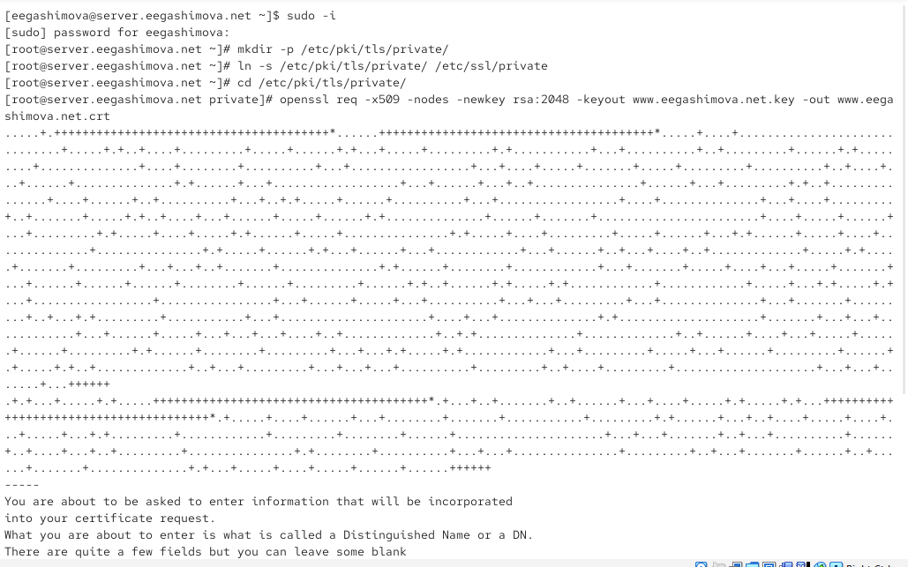
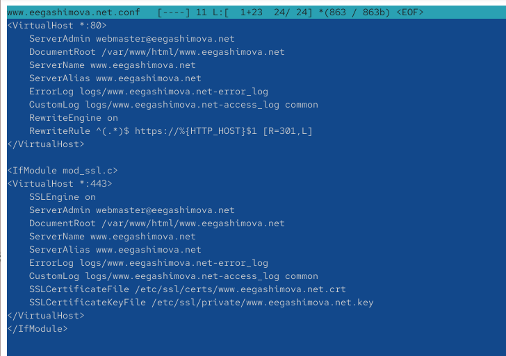
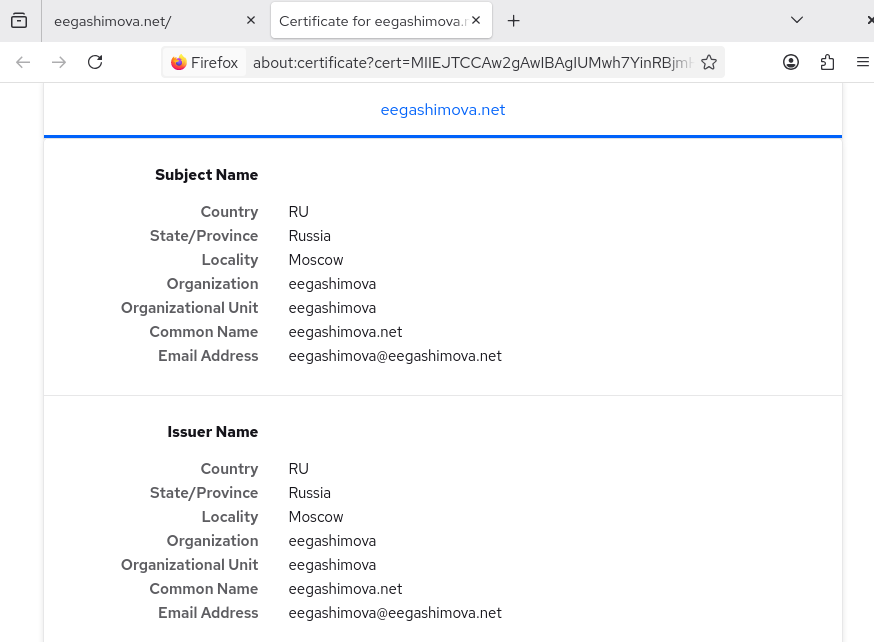
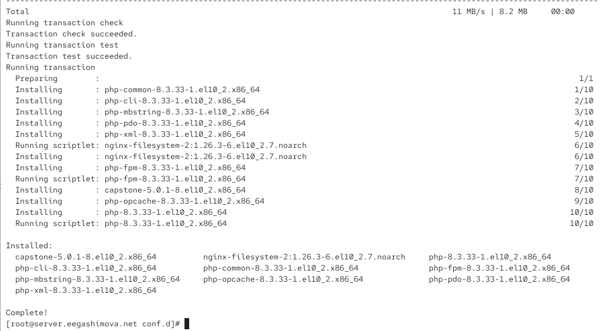
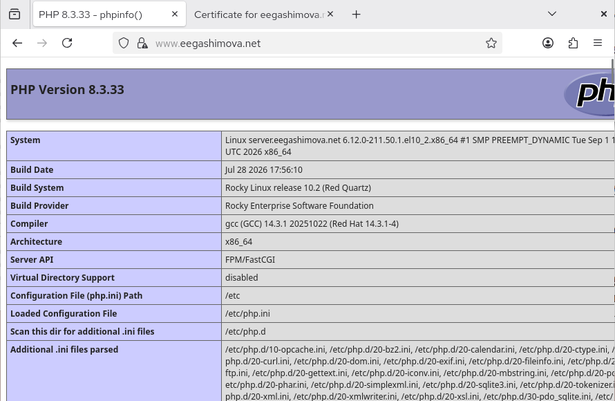
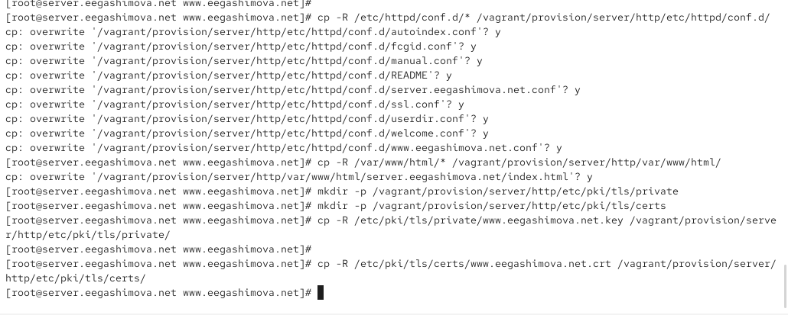

---
## Author
author:
  name: Гашимова Эсма Эльшан кызы
  email: 1132247520@rudn.ru
  affiliation:
    - name: Российский университет дружбы народов
      country: Российская Федерация
      postal-code: 117198
      city: Москва
      address: ул. Миклухо-Маклая, д. 6

## Title
title: "Отчёт по лабораторной работе №5"
subtitle: "Расширенная настройка HTTP-сервера Apache"
license: "CC BY"
---

# Цель работы

Приобретение практических навыков по расширенному конфигурированию HTT Pсервера Apache в части безопасности и возможности использования PHP.

# Выполнение лабораторной работы

## Генерация криптографического ключа и самоподписанного сертификата

На виртуальной машине `server` перехожу в режим суперпользователя. Для хранения закрытого ключа создаю каталог `/etc/pki/tls/private`, после чего создаю символическую ссылку `/etc/ssl/private` на данный каталог. Затем перехожу в каталог с закрытыми ключами и с помощью `openssl` генерирую новый закрытый RSA-ключ длиной 2048 бит и самоподписанный сертификат X.509 для веб-сервера `www.eegashimova.net` (см. рис. [@fig-001]).

При формировании сертификата параметр `-x509` задаёт создание самоподписанного сертификата X.509, параметр `-nodes` отключает защиту закрытого ключа парольной фразой, а `-newkey rsa:2048` создаёт новый RSA-ключ длиной 2048 бит. Параметры `-keyout` и `-out` задают имена файлов закрытого ключа и сертификата соответственно.

{ #fig-001 width=70% }

## Настройка виртуального хоста для работы по HTTPS

Для перевода виртуального хоста на HTTPS редактирую файл `/etc/httpd/conf.d/www.eegashimova.net.conf`. В конфигурации оставляю виртуальный хост на порту `80`, предназначенный для перенаправления HTTP-запросов на HTTPS, и добавляю виртуальный хост на порту `443`, в котором включаю SSL и указываю созданные сертификат и закрытый ключ (см. рис. [@fig-002]).

{ #fig-002 width=70% }

Конфигурационный файл содержит следующие параметры:

```apache
<VirtualHost *:80>
    ServerAdmin webmaster@eegashimova.net
    DocumentRoot /var/www/html/www.eegashimova.net
    ServerName www.eegashimova.net
    ServerAlias www.eegashimova.net
    ErrorLog logs/www.eegashimova.net-error_log
    CustomLog logs/www.eegashimova.net-access_log common
    RewriteEngine on
    RewriteRule ^(.*)$ https://%{HTTP_HOST}$1 [R=301,L]
</VirtualHost>

<IfModule mod_ssl.c>
<VirtualHost *:443>
    SSLEngine on
    ServerAdmin webmaster@eegashimova.net
    DocumentRoot /var/www/html/www.eegashimova.net
    ServerName www.eegashimova.net
    ServerAlias www.eegashimova.net
    ErrorLog logs/www.eegashimova.net-error_log
    CustomLog logs/www.eegashimova.net-access_log common
    SSLCertificateFile /etc/ssl/certs/www.eegashimova.net.crt
    SSLCertificateKeyFile /etc/ssl/private/www.eegashimova.net.key
</VirtualHost>
</IfModule>
```

Строка `<VirtualHost *:80>` открывает описание виртуального хоста, принимающего соединения на стандартном HTTP-порту `80`.

Директива `ServerAdmin webmaster@eegashimova.net` задаёт адрес электронной почты администратора веб-сервера.

Директива `DocumentRoot /var/www/html/www.eegashimova.net` указывает каталог, содержащий файлы веб-сайта.

Директива `ServerName www.eegashimova.net` определяет основное доменное имя данного виртуального хоста.

Директива `ServerAlias www.eegashimova.net` определяет дополнительное имя, по которому виртуальный хост может обрабатывать запросы.

Директива `ErrorLog logs/www.eegashimova.net-error_log` задаёт файл журнала, в который Apache записывает сообщения об ошибках данного виртуального хоста.

Директива `CustomLog logs/www.eegashimova.net-access_log common` задаёт отдельный журнал запросов к виртуальному хосту и использует стандартный формат журналирования `common`.

Директива `RewriteEngine on` включает механизм преобразования URL модуля `mod_rewrite`.

Директива `RewriteRule ^(.*)$ https://%{HTTP_HOST}$1 [R=301,L]` перенаправляет любой запрос, поступивший по HTTP, на аналогичный адрес с использованием HTTPS. Флаг `R=301` задаёт постоянное перенаправление с кодом HTTP `301`, а флаг `L` указывает, что после срабатывания данного правила дальнейшие правила преобразования применять не требуется.

Строка `</VirtualHost>` завершает описание виртуального хоста на порту `80`.

Строка `<IfModule mod_ssl.c>` указывает, что расположенная внутри конфигурация используется при наличии загруженного модуля Apache `mod_ssl`.

Строка `<VirtualHost *:443>` открывает описание защищённого виртуального хоста, принимающего HTTPS-соединения на порту `443`.

Директива `SSLEngine on` включает использование SSL/TLS для данного виртуального хоста.

Директивы `ServerAdmin`, `DocumentRoot`, `ServerName`, `ServerAlias`, `ErrorLog` и `CustomLog` выполняют те же функции, что и в виртуальном хосте на порту `80`, но применяются к HTTPS-соединениям.

Директива `SSLCertificateFile /etc/ssl/certs/www.eegashimova.net.crt` указывает путь к файлу сертификата, который веб-сервер передаёт клиенту при установлении защищённого соединения.

Директива `SSLCertificateKeyFile /etc/ssl/private/www.eegashimova.net.key` задаёт путь к закрытому ключу, соответствующему используемому сертификату.

Строка `</VirtualHost>` завершает описание HTTPS-виртуального хоста, а `</IfModule>` завершает условный блок конфигурации модуля `mod_ssl`.

## Настройка межсетевого экрана для HTTPS

Для обеспечения доступа клиентов к веб-серверу по HTTPS добавляю сервис `https` в текущую и постоянную конфигурации `firewalld`. После внесения изменений перезагружаю правила межсетевого экрана и перезапускаю службу `httpd`. Команды завершаются успешно, следовательно, сервер готов принимать защищённые соединения на порту `443` (см. рис. [@fig-003]).

{ #fig-003 width=70% }

## Проверка работы веб-сервера по HTTPS

На виртуальной машине `client` открываю в браузере адрес `www.eegashimova.net`. Настроенное правило перенаправления переводит соединение с HTTP на HTTPS. Поскольку для сервера используется самостоятельно подписанный сертификат, браузер не доверяет его издателю и выводит предупреждение `SEC_ERROR_UNKNOWN_ISSUER`. Перехожу к дополнительным параметрам и разрешаю использование данного сертификата для тестового веб-сервера (см. рис. [@fig-004]).

{ #fig-004 width=70% }

После добавления исключения браузер открывает страницу виртуального хоста `www.eegashimova.net` по защищённому соединению. В адресной строке отображается значок защищённого соединения, а содержимое созданной ранее страницы успешно загружается с веб-сервера (см. рис. [@fig-005]).

{ #fig-005 width=70% }

Просматриваю сведения о сертификате в браузере. В поле страны указано `RU`, региона — `Russia`, города — `Moscow`. В качестве организации и подразделения указано `eegashimova`, общее имя сертификата — `eegashimova.net`, а адрес электронной почты — `eegashimova@eegashimova.net`. Поскольку сертификат является самоподписанным, данные субъекта и издателя совпадают (см. рис. [@fig-006]).

{ #fig-006 width=70% }

## Настройка HTTP-сервера для работы с PHP

Для добавления поддержки PHP устанавливаю пакет `php` с помощью пакетного менеджера `dnf`. Вместе с основным пакетом устанавливаются необходимые зависимости и дополнительные компоненты, в том числе `php-cli`, `php-common`, `php-fpm`, `php-mbstring`, `php-opcache`, `php-pdo` и `php-xml`. Установка завершается сообщением `Complete!` (см. рис. [@fig-007]).

{ #fig-007 width=70% }

В каталоге веб-сайта `/var/www/html/www.eegashimova.net` создаю файл `index.php`. В файл помещаю вызов функции `phpinfo()`, которая выводит информацию о текущей конфигурации PHP, его версии, подключённых модулях и параметрах среды выполнения (см. рис. [@fig-008]).

```php
<?php
    phpinfo();
?>
```

{ #fig-008 width=70% }

После создания PHP-страницы изменяю владельца содержимого каталога `/var/www` на пользователя и группу `apache` командой `chown -R apache:apache /var/www/`. Далее восстанавливаю контексты безопасности SELinux для каталогов `/etc` и `/var/www` при помощи `restorecon -vR`. После выполнения настроек перезапускаю службу `httpd`, чтобы веб-сервер продолжил работу с обновлённой конфигурацией (см. рис. [@fig-009]).

{ #fig-009 width=70% }

На виртуальной машине `client` повторно открываю адрес `www.eegashimova.net`. Вместо исходной HTML-страницы отображается результат выполнения функции `phpinfo()`. На странице указана установленная версия `PHP 8.3.33`, информация об операционной системе, архитектуре `x86_64`, Server API `FPM/FastCGI`, расположении файла `/etc/php.ini` и другие параметры PHP. Появление данной страницы подтверждает корректную обработку PHP-файлов веб-сервером (см. рис. [@fig-010]).

{ #fig-010 width=70% }

## Внесение изменений в настройки внутреннего окружения виртуальной машины

Для сохранения выполненной конфигурации в проекте Vagrant копирую содержимое `/etc/httpd/conf.d` в каталог `/vagrant/provision/server/http/etc/httpd/conf.d`, а содержимое `/var/www/html` — в `/vagrant/provision/server/http/var/www/html`. При копировании подтверждаю замену существующих конфигурационных файлов.

Затем создаю в каталоге provisioning структуру `/vagrant/provision/server/http/etc/pki/tls/private` и `/vagrant/provision/server/http/etc/pki/tls/certs`. В эти каталоги копирую соответственно закрытый ключ `www.eegashimova.net.key` и сертификат `www.eegashimova.net.crt`. В результате конфигурация веб-сервера, содержимое сайта и криптографические файлы сохраняются в проекте Vagrant и могут быть использованы при повторном создании виртуальной машины (см. рис. [@fig-011]).

{ #fig-011 width=70% }

Редактирую скрипт `/vagrant/provision/server/http.sh`, отвечающий за автоматическую настройку HTTP-сервера. В существующий сценарий добавляю установку PHP командой `dnf -y install php`. Скрипт копирует сохранённые конфигурационные файлы и содержимое `/var/www`, устанавливает владельца `apache:apache`, восстанавливает контексты SELinux и настраивает межсетевой экран.

Для межсетевого экрана добавляю разрешение сервисов `http` и `https` как в текущую, так и в постоянную конфигурацию `firewalld`. В заключительной части скрипта служба `httpd` добавляется в автозагрузку и запускается. В результате расширенная настройка HTTP-сервера, включая поддержку HTTPS и PHP, фиксируется в сценарии автоматического развёртывания виртуальной машины (см. рис. [@fig-012]).

{ #fig-012 width=70% }

# Вывод

В ходе лабораторной работы веб-сервер Apache настроен для работы по протоколу HTTPS. Сгенерированы закрытый ключ и самоподписанный сертификат, настроено перенаправление с HTTP на HTTPS и разрешён сервис `https` в `firewalld`.

Также установлена поддержка PHP и выполнена проверка работы с помощью функции `phpinfo()`. В завершение конфигурация сервера сохранена в проекте Vagrant, а скрипт `http.sh` дополнен настройками HTTPS и PHP.

# Контрольные вопросы

**1. В чём отличие HTTP от HTTPS?**

HTTP передаёт данные без шифрования и обычно использует порт `80`. HTTPS использует TLS для шифрования передаваемых данных и работает через порт `443`.

**2. Каким образом обеспечивается безопасность контента веб-сервера при работе через HTTPS?**

HTTPS использует протокол TLS, который обеспечивает шифрование данных, проверку их целостности и подтверждение подлинности веб-сервера с помощью цифрового сертификата.

**3. Что такое сертификационный центр? Приведите пример.**

Сертификационный центр (CA) — организация, которая выпускает и подписывает цифровые сертификаты, подтверждая их подлинность. Пример сертификационного центра — `Let's Encrypt`.